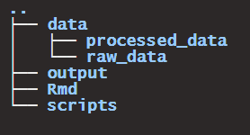

**Aim**: Plot histogram intensity from imaging experiment **Contact**: [alexandre.bokhobza\@gmail.com](mailto:alexandre.bokhobza@gmail.com){.email}

------------------------------------------------------------------------

# Pre-requisites:

1- Specific root folder structure:

The root folder should be named: Intensity_Histogram.\
The structure of the root folder should be:\


2- Installing / Loading required packages:

```{r echo = FALSE, include=FALSE}
# Packages names
packages <- c("tidyverse","here","shiny","fs","plotly")

#Install missing packages

installed_packages <- packages %in% rownames(installed.packages())
if (any(installed_packages == FALSE)) {
  installed.packages(packages [!installed_packages])
}

# Packages loading
invisible(lapply(packages, library, character.only = TRUE))

# Delete variables

rm(installed_packages, packages)

# code from: https://statsandr.com/blog/an-efficient-way-to-install-and-load-r-packages/

```

3- Define the current directory using here package:

```{r echo = FALSE}

here::i_am("Intensity_Histogram.Rproj")


```

4- Include session information:

```{r echo = FALSE}

xfun::session_info()

```

# Plot the histogram

<!-- Read the data -->

```{r echo = FALSE, results='hide'}

data_path <- paste(here("data", "raw_data"), list.files(here("data", "raw_data")), sep = "/")

df_input <- map(data_path, readxl::read_excel)

names(df_input) <- str_replace(list.files(here("data", "raw_data")), pattern = ".xlsx", replacement = "")

df <- bind_rows(df_input, .id = 'id')

# Cleaning
rm(data_path, df_input)

# Save the tidy dataframe:
  # write.csv(df, here("df.csv"))

```

<!-- Generate histogram -->

```{r echo = FALSE}

ggplot(df, aes(x=Value, fill=id)) + geom_histogram(binwidth = 5)


```
